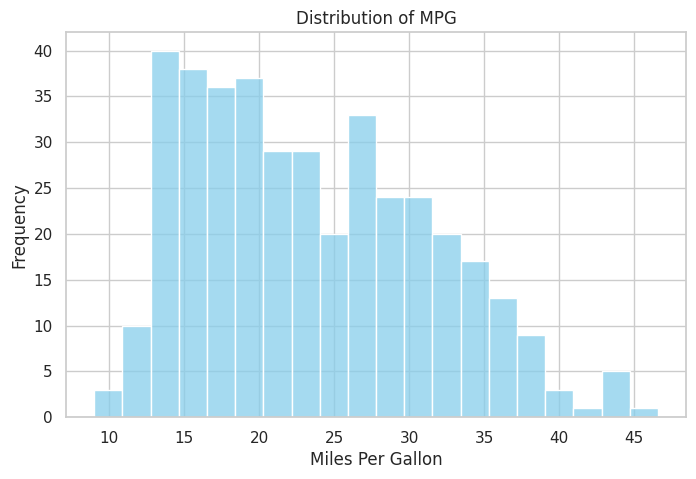
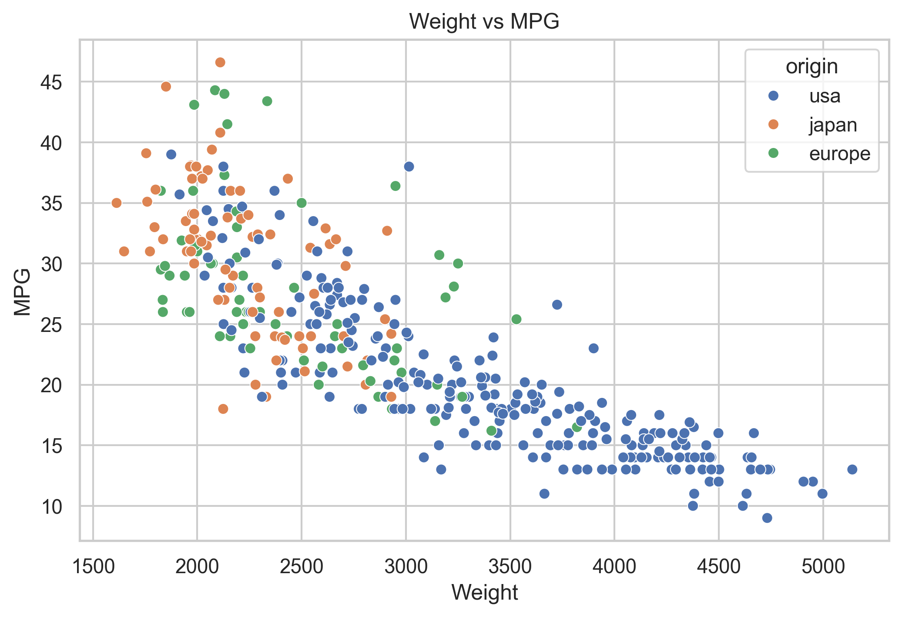
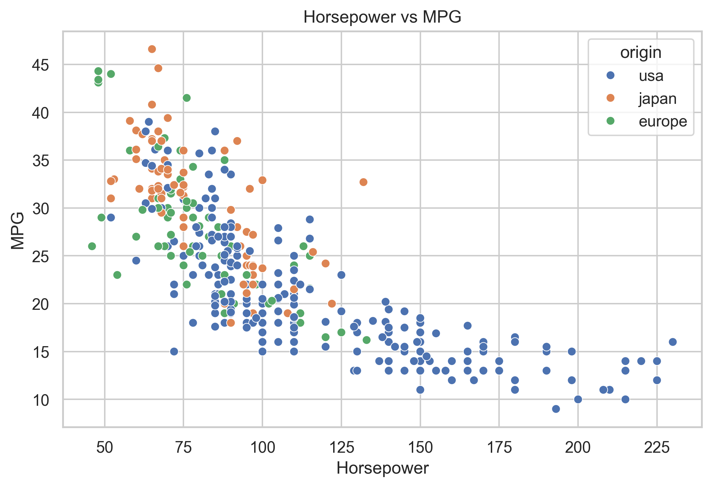
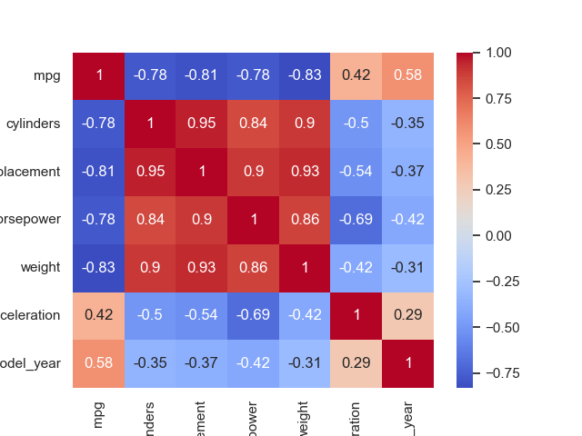
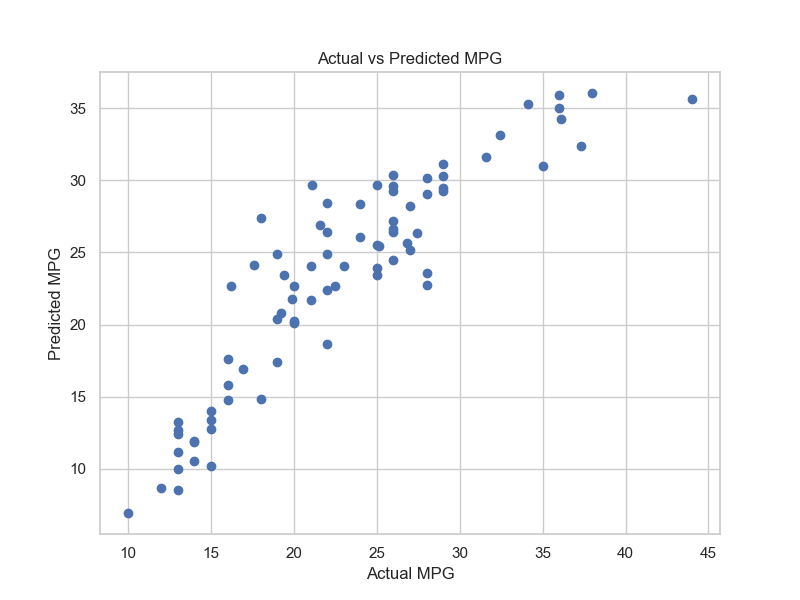

# Auto MPG Prediction Using Linear Regression

This project applies **Linear Regression** to predict vehicle fuel efficiency (Miles Per Gallon - MPG) based on various vehicle characteristics. The project covers the complete machine learning workflow, including data preprocessing, exploratory data analysis, feature engineering, model training, and performance evaluation.

---

## Project Overview

Fuel efficiency is an important aspect of vehicle performance. This project aims to predict a car's fuel efficiency (MPG) using technical specifications such as engine size, horsepower, vehicle weight, acceleration, production year, and country of origin.

---

## Dataset

**Dataset:** Auto MPG Dataset

**Source:** https://raw.githubusercontent.com/mwaskom/seaborn-data/master/mpg.csv

### Dataset Features

| Feature | Description |
|---------|-------------|
| mpg | Miles Per Gallon (Target Variable) |
| cylinders | Number of engine cylinders |
| displacement | Engine displacement |
| horsepower | Engine horsepower |
| weight | Vehicle weight |
| acceleration | Vehicle acceleration |
| model_year | Model production year |
| origin | Country of origin |
| name | Vehicle name |

---

## Project Objectives

- Predict vehicle fuel efficiency (MPG).
- Explore factors affecting fuel consumption.
- Build a Linear Regression model.
- Evaluate model performance using R² Score and RMSE.

---

## Technologies Used

- Python
- Pandas
- NumPy
- Matplotlib
- Seaborn
- Scikit-learn

---

## Repository Structure

```
auto-mpg-prediction
│
├── data
│   └── mpg.csv
│
├── images
│   ├── mpg_distribution.png
│   ├── weight_vs_mpg.png
│   ├── horsepower_vs_mpg.png
│   ├── correlation_heatmap.png
│   └── actual_vs_predicted.png
│
├── linear_regression_analysis.py
├── README.md
├── requirements.txt
└── .gitignore
```

---

## Machine Learning Workflow

1. Data Loading
2. Data Cleaning
3. Exploratory Data Analysis (EDA)
4. Feature Engineering
5. Train-Test Split
6. Linear Regression Model
7. Model Evaluation
8. Conclusion

---

## Exploratory Data Analysis

### MPG Distribution



---

### Vehicle Weight vs MPG



---

### Horsepower vs MPG



---

### Correlation Heatmap



---

## Model Evaluation

### Actual vs Predicted MPG



---

### Model Performance

| Metric | Value |
|--------|------:|
| R² Score | **0.79** |
| RMSE | **3.26** |

---

## Key Findings

- Vehicle weight has a strong negative relationship with fuel efficiency.
- Higher horsepower generally leads to lower MPG.
- Newer vehicles tend to have better fuel efficiency.
- Country of origin also influences fuel efficiency.
- The Linear Regression model explains approximately **79%** of the variation in MPG.

---

## Feature Engineering

The following preprocessing steps were performed before model training:

- Removed missing values.
- Dropped the `name` column.
- Applied One-Hot Encoding to the `origin` feature.
- Split the dataset into training (80%) and testing (20%) sets.

---

## How to Run

### Clone this repository

```bash
git clone https://github.com/hannazan/auto-mpg-prediction.git
```

### Move into the project directory

```bash
cd auto-mpg-prediction
```

### Install dependencies

```bash
pip install -r requirements.txt
```

### Run the project

```bash
python linear_regression_analysis.py
```

---

## Conclusion

The Linear Regression model demonstrates good predictive performance for estimating vehicle fuel efficiency.

Vehicle weight, horsepower, and production year are among the most influential features affecting MPG. With an R² Score of **0.79**, the model successfully captures most of the variation in fuel efficiency.

---

## Author

**Hanna Zahra Nadia**

Mathematics Graduate | Aspiring Data Analyst & Data Scientist

- GitHub: https://github.com/hannazan
- LinkedIn: *https://linkedin.com/in/hannazan*

---

## Future Improvements

- Compare multiple regression algorithms (Random Forest, XGBoost).
- Perform hyperparameter tuning.
- Apply feature selection techniques.
- Deploy the model as a web application using Streamlit.